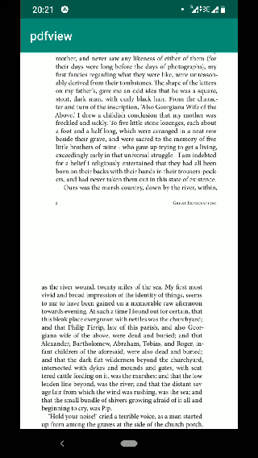

# pdfview

[](https://app.bitrise.io/app/40d453ac50882d9c)
[](https://maven-badges.herokuapp.com/maven-central/com.dmitryborodin/pdfview-android)
[](https://opensource.org/licenses/Apache-2.0)
[]( https://android-arsenal.com/details/1/7820 )

Android PDF view - small (73kB .aar file, ~400 methods before minification) and efficient PDF viewer embedded in your native app

It is based on ImageView and can handle big files with reasonable scrolling and zooming performance. 

This is how fast scrolling of 680 page document looks like on low-end device:



## Usage:

To show pdf you just need a file on the device.

```
findViewById<PDFView>(R.id.activityMainPdfView).fromAsset("paper.pdf").show()
```
See [sources](/pdfview-android/src/main/java/com/pdfview/PDFView.kt) for other methods to provide a file.

If pdf is on remote host - use your network client to download it to the cache folder, then show it. This library provides view, it doesn't do network requests.

There is a [sample](/sample-network) of how to do it.

## Add to your project:

The library is hosted in the central repository.
```
     repositories {
        <...>
        mavenCentral()
    }
```

Add gradle dependency:
```
implementation "com.dmitryborodin:pdfview-android:1.1.0"
```

## Wiki
Please take a look into [the wiki](/../../wiki) to find out the technical details.

## Contrubitions

Contributions are welcome. 
Just open PR to dev branch.

Feel free to open issue with any questions.

## Credits
Thanks to [Manuel Lilienberg](https://github.com/mlilienberg) for initial implementation of this library and [subsampling-scale library](https://github.com/davemorrissey/subsampling-scale-image-view) for influence.
